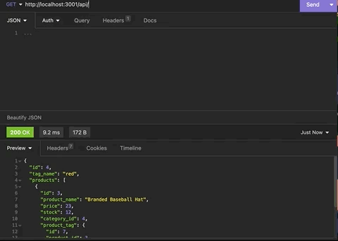
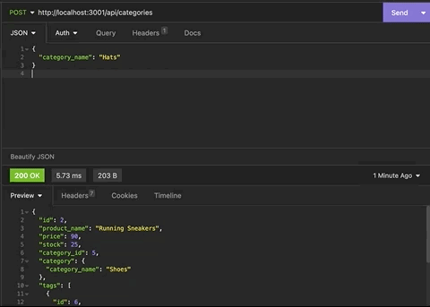
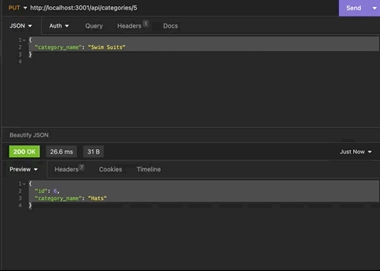
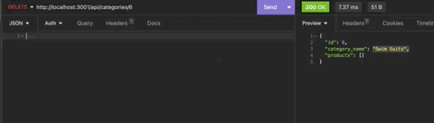

# Object-Relational Mapping: E-commerce Back End 

  [](https://opensource.org/licenses/MIT)

  ## Description

  This project was meant to challenge me to build the back end for an e-commerce site with Express.js API. The project was configured with Sequelized to interact witha MySQL database to perform API POST, PUT, and DELETE routes in a Insomnia Core envioronment.

   Walkthrough video: https://drive.google.com/file/d/1a55dJ-LmrnwW4VuiQ_NDB5Ky_5Qo9KYK/view?usp=sharing

  ## Table of Contents

  - [Installation](#installation)
  - [Usage](#usage)
  - [License](#license)

  ## Installation

  Because this project contains only the backend aspects, clone the code to your local environment. First, create a .env file in the root of the app and add 
  ```
  DB_NAME='ecommerce_db'
  DB_USER='root'
  DB_PASSWORD='****'
  ```
  
  Next, open the integrated terminal and run 'npm i' to install the dependancies. Next, enter your access info for MySQL and run 'SOURCE schema.sql' (if you open the integrated terminal from the root, you will have to enter './db/schema.sql;' instead). Then type 'USE ecommerce_db' to initiallize the database. Next open a new terminal tab and type 'npm run watch' to start the database with nodemon, or 'npm run start' to initialize with node. Then, open another terminal tab and type 'npm run seed' to seed the database once the server is running.

  ## Usage

  Once you have successfully initiated the database, started the server, and seeded the database, you can then begin to test the backend functionality in Insomnia Core.

  From the root URL of 'http://localhost:3001/api/' you can access the API data of the tables for 'Categories', 'Products', and 'Tags'.

  To test GET requests for all data from each table, input the table name after 'api/' (EX: 'api/categories', 'api/products', or 'api/tags').
  To test GET requests for an individual item by it's ID, input the table name followd by the desired item's ID (EX: 'api/products/5').

  

  To test POST requests, enter the desired table to add the new data to into the end of the URL. Then make sure to select 'JSON' as your text type to enter the data you wish to create.

  

  To test PUT requests, you will need to identify the category and the item you want to update by it's ID. Then enter the new data as JSON text.

  

  To POST/PUT a new Category, enter an object with a key of 'category_name'.

  To POST/PUT a new Product, enter an object with a key for the 'product_name', 'price', number in 'stock', and the correspondig 'tagIds'.

  To POST/PUT a new Tag, enter an object with a key for the 'tag_name'.

  ```
    {
        "category_name": "Hats"
    }
  ```

  ```
    {
        "product_name": "Basketball",
        "price": 200.00,
        "stock": 3,
        "tagIds": [1, 2, 3, 4]
    }
  ```

  ```
    {
	    "tag_name": "Summer"
    }
  ```

  To DELETE an item, enter the item ID after it's corresponding category.

  

  ## License

  This project is licensed under the terms of the MIT license 

  ---

  ## Badges

  

  ## How to Contribute

  N/A

  ## Tests

  N/A

  ## Questions

  If you have any questions regarding this application please contact me through email or GitHub:

  boushka9@gmail.com

  boushka9

  